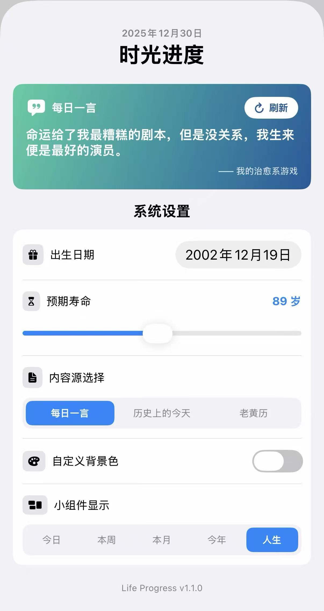
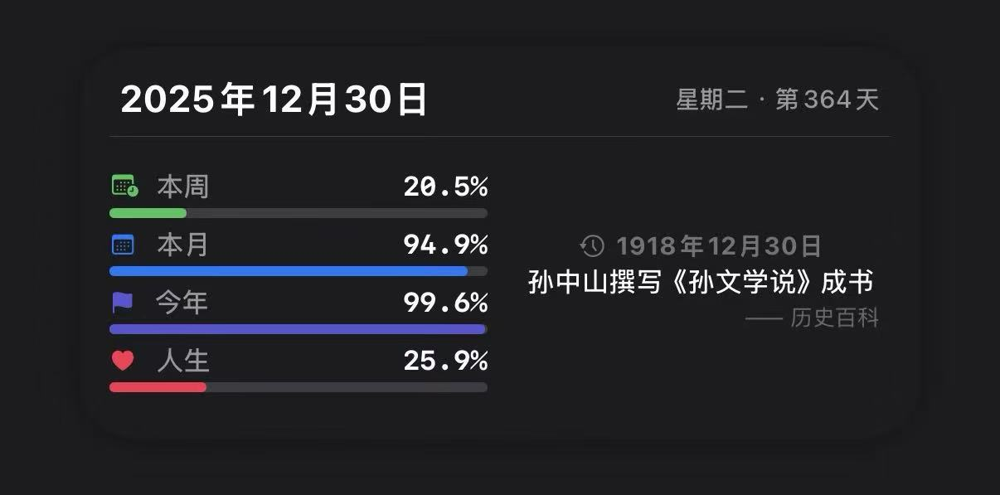
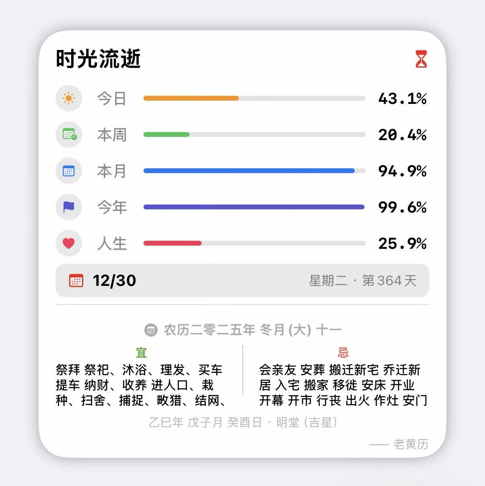

# My Scripting Collection 🚀

## 简介 📖

本项目是一个专为 [Scripting APP](https://apps.apple.com/us/app/scripting/id6479691128?l=zh-Hans-CN) 打造的脚本合集。包含了一系列基于 TypeScript/JavaScript 开发的自动化工具、UI 页面、小组件及灵动岛脚本，旨在提升移动端的生产力体验。

---

## 脚本列表 🛠️

### 📦 Life Progress

* **功能描述**：基于 Scripting App 开发的 iOS 时间进度追踪与桌面美化脚本。
* **特性**：
- **多维度时间追踪**：实时计算并展示今日、本周、本月、今年及人生的进度百分比。
- **可视化仪表盘**：精美的进度条与图标展示，直观感受时间流逝。
- **动态内容生态**：集成多种数据源，支持在小组件中切换显示：
  - **每日一言**：精选励志、文学名言。
  - **历史上的今天**：探索历史长河中的重大事件（支持列表轮转）。
  - **老黄历**：提供农历日期及每日宜忌信息。
- **全尺寸小组件支持**：
  - **小号 (Small)**：聚焦单一进度项，支持点击切换显示类型。
  - **中号 (Medium)**：左侧显示关键进度，右侧展示动态内容。
  - **大号 (Large)**：全方位的进度看板与底部动态内容区。

    

---

### 📦 Parcel Collection (快递取件码集合)

* **功能描述**：一款基于 Scripting App 的自动化快递取件码管理工具。配合 iOS 快捷指令，可实现短信信息的自动提取、持久化存储以及交互式小组件便捷展示。
* **特性**：
- **自动化智能提取**：集成正则匹配与 AI 智能解析（Assistant API），精准识别短信中的取件码、驿站地址及包裹来源。
- **交互式桌面小组件**：完美支持 iOS 17+ 交互式小组件。提供小、中、大三种尺寸，无需打开 App 即可直接在主屏幕上一键标记“已取件”。
- **完善的数据管理**：
  - **持久化与同步**：基于 `Storage` API 实现跨脚本数据共享，并支持多设备间的数据同步。
  - **自动清理与归档**：已取件包裹会自动移至历史记录，历史记录仅保留 3 天，保持数据精简与隐私安全。
  - **智能去重逻辑**：基于取件码与地址生成 MD5 指纹，有效防止同一条取件信息的重复录入。
- **快捷指令无缝联动**：支持通过 iOS“快捷指令”App 配置自动化（当收到包含特定关键字的短信时触发），将信息内容传递给脚本，实现全自动录入。
- 
* **快捷指令设置 (iOS Shortcuts)**
为了实现自动化提取，请在 iOS “快捷指令” App 中创建一个自动化：
- **触发条件**：收到信息 -> 包含关键字（如：取件码、驿站、丰巢）。
- **操作步骤**：
  1. 获取短信内容。
  2. 运行脚本：选择 **Scripting** -> **运行脚本**。
  3. 脚本选择：`Parcel Collection`。
  4. 参数传递：将“信息内容”传递给参数。
---

## 开发指南 👩‍💻

如果您想基于本项目进行二次开发：

* 建议使用 **TypeScript** 编写，以获得更好的类型提示。
* 参考官方 [API 文档](https://scripting.fun/doc_v2/zh/index) 了解 UI、Intent 和 Live Activity 的调用方法。

## 相关资源 🔗

* [Scripting 官方文档](https://scripting.fun/doc_v2/zh/index) - 核心 API 与指南
* [Scripting APP](https://apps.apple.com/us/app/scripting/id6479691128) - 前往 App Store 下载 

## 鸣谢 ⚖️

* 感谢 [Scripting APP](https://apps.apple.com/us/app/scripting/id6479691128) 开发者提供的强大平台。
* 感谢开源社区中所有分享脚本思路的大佬。

---

**免责声明**：本仓库脚本仅供学习和交流使用。使用脚本产生的任何后果由使用者自行承担，请在运行前阅读源码以确保安全。
